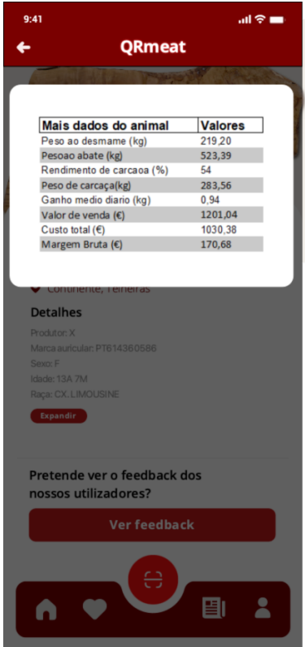
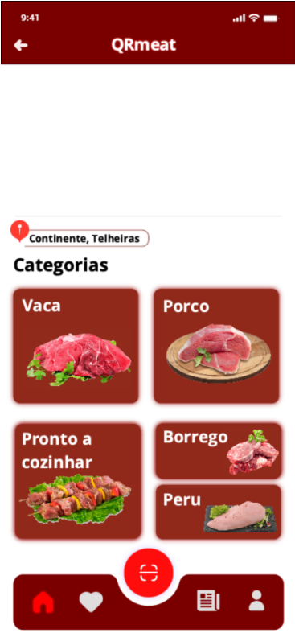

<table>
  <tr>
    <th>Views</th>
    <th>Components</th>
    <th>ViewModels</th>
  </tr>
  <tr>
    <td rowspan="1"></td>
    <td>TableDetails</td>
    <td></td>
  </tr>
  <tr>
    <td rowspan="2"></td>
    <td>CategoriasDisplay</td>
    <td></td>
  </tr>
  <tr>
    <td>Location</td>
    <td></td>
  </tr>
   <tr>
    <td rowspan="6"></td>
    <td>SavedDisplay</td>
    <td></td>
  </tr>
  <tr>
    <td rowspan="5">ProductInfo</td>
    <td>props.name</td>
      <tr>
    <td>props.price</td>
      <tr>
    <td>props.location</td>
      <tr>
    <td>props.image</td>
  </tr>
  <tr>
 

  <tr>
     <td rowspan="9"></td>
    <tr>
     <td>Header</td>
      <td>props.imgSrc</td></tr>
    <td rowspan="3">ProductInfo</td>
    <td>props.name</td>
      <tr>
    <td>props.price</td>
      <tr>
    <td>props.location</td>
      <tr>
   
  </tr>
  <tr>
    <td>ProductDetails</td>
    <td>props.productDetails</td>
  </tr>
  <tr>
    <td>Expand</td>
    <td></td>
  </tr>
  <tr>
    <td>Feedback</td>
    <td></td>
  </tr>
  <tr>
    <td rowspan="6"></td>
    <td>Header</td>
    <td></td>
  </tr>
  <tr>
    <td>HighlightsDisplay</td>
    <td></td>
  </tr>
  <tr>
    <td rowspan="5">ProductInfo</td>
    <td>props.name</td>
      <tr>
    <td>props.price</td>
      <tr>
    <td>props.location</td>
      <tr>
    <td>props.image</td>
  </tr>

</table>