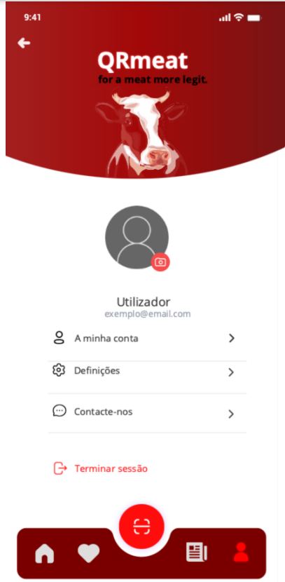
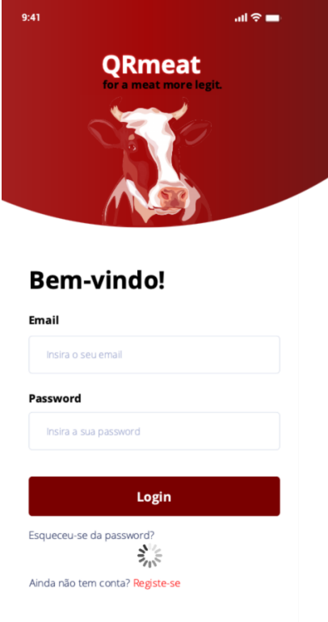

<table>
  <tr>
    <th>Micro-frontends</th>
    <th>Views</th>
    <th>FE services</th>
  </tr>

  <tr>
    <td rowspan="7">Account</td>
    <td  rowspan="4"></td>
    <td >Display user account information</td>
  </tr>
  <tr>
    <td>Provide options for managing user account</td>
  </tr>
  <tr>
    <td>Allow users to contact support</td>
  </tr>
  <tr>
    <td>Provide option to log out</td>
  </tr>

  <tr>
    <td rowspan="3" ></td>
    <td> Login form </td>
  </tr>
  <tr>
    <td>Include option for "forgot password"</td>
  </tr>
  <tr>
    <td>Provide link for user registration</td>
  </tr>

</table>